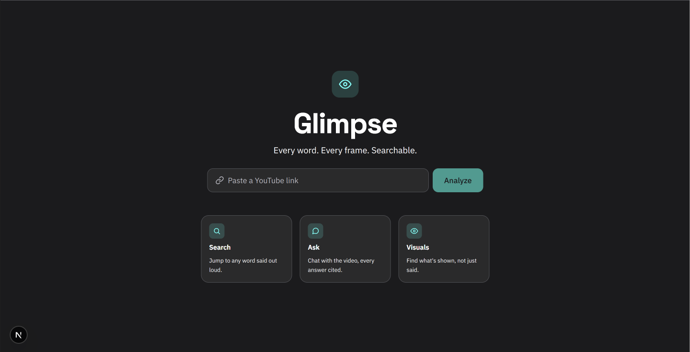
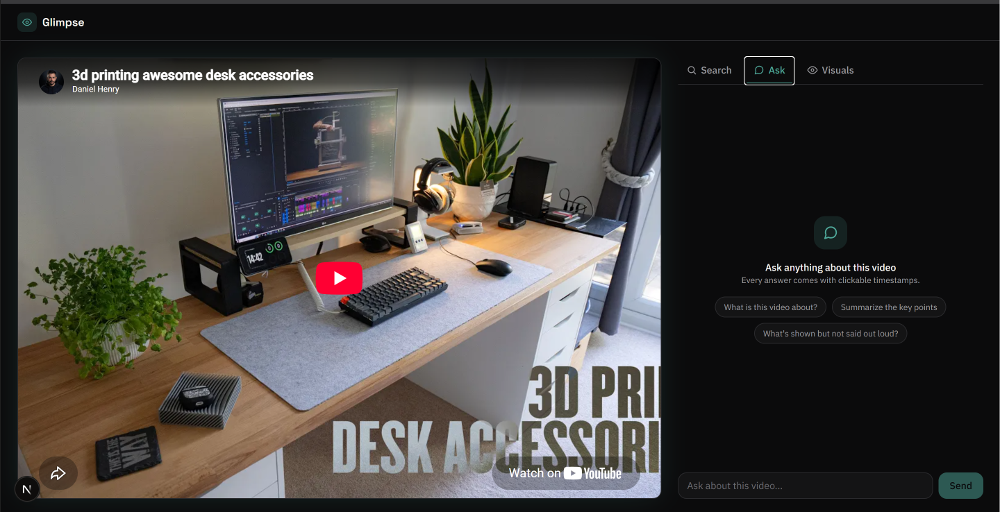
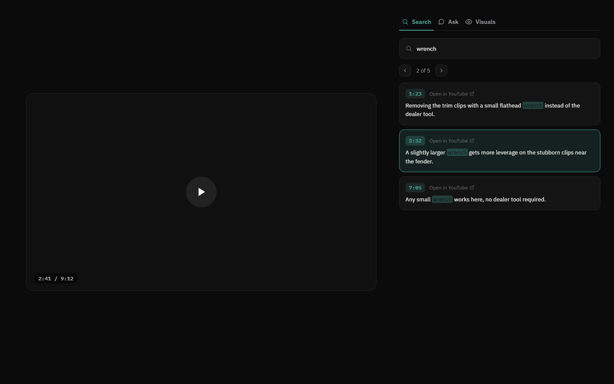

# Glimpse

**Ctrl+F for video.** Paste a YouTube link and search what was *said*, ask questions about the video, or scan what's *shown* on screen — objects, on-screen text, charts — even if it was never spoken aloud.

Built in 24 hours. Runs entirely locally, no cloud deploy.

<p align="center">
  
  
</p>
<p align="center">
  
</p>

## Features

- **Search** — case-insensitive search across the transcript, including phrases split across caption lines. Every result is a clickable timestamp that seeks and plays the video. No AI involved — instant and free.
- **Ask** — chat with the video using Gemini. Answers cite `[mm:ss]` timestamps (clickable), give a real opinion with evidence when asked, and draw on both the transcript *and* the visual scan (if one's been run) — so it can answer questions about things that were shown but never said.
- **Visuals** — click "Scan visuals" to download the video, extract frames, dedupe near-identical ones, and have Gemini describe each one (people, objects, on-screen text, charts). Then search *that* — a local keyword search over the descriptions, same instant/free search as the transcript tab. Results show a thumbnail, timestamp, and description; click to seek.
- If a search turns up nothing in what was said, the app offers to check what was shown instead — and vice versa.

## Tech stack

- **Frontend:** Next.js (App Router, TypeScript, Tailwind CSS v4) — `frontend/`
- **Backend:** Python FastAPI — `backend/`
- **AI:** Google Gemini (`gemini-3.5-flash-lite`) via the `google-genai` SDK
- **Transcripts:** `youtube-transcript-api`
- **Video/frames:** `yt-dlp` for download, `ffmpeg` for frame extraction, `imagehash` + Pillow for deduplication
- **Player:** YouTube IFrame Player API (for programmatic seeking)

## Project structure

```
backend/
  main.py                  FastAPI app — /analyze, /ask, /scan endpoints
  video_utils.py            YouTube URL → video ID parsing
  visual_pipeline.py        Download, frame extraction, dedup
  visual_descriptions.py    Batches frames to Gemini for descriptions
  data/                     Per-video cache (transcript, frames, descriptions) — gitignored
frontend/
  app/page.tsx                       Home page
  app/watch/[videoId]/page.tsx       Results page (player + tabs)
  app/watch/[videoId]/SearchTab.tsx
  app/watch/[videoId]/AskTab.tsx
  app/watch/[videoId]/VisualsTab.tsx
  app/watch/[videoId]/YouTubePlayer.tsx
```

## Setup (first time only)

### Backend

```
cd /d C:\Dev\Glimpse\backend
python -m venv venv
venv\Scripts\activate
pip install -r requirements.txt
```

Create `backend\.env` with a [Gemini API key](https://aistudio.google.com/apikey):

```
GEMINI_API_KEY=your_key_here
```

Requires `ffmpeg` installed and on your PATH (used for frame extraction).

### Frontend

```
cd /d C:\Dev\Glimpse\frontend
npm install
```

## Running the app

Open two terminals.

**Backend:**

```
cd /d C:\Dev\Glimpse\backend
venv\Scripts\activate
uvicorn main:app --reload --port 8000
```

**Frontend:**

```
cd /d C:\Dev\Glimpse\frontend
npm run dev
```

Open http://localhost:3000, paste a YouTube link, and click Analyze.

## Caching

Everything is cached under `backend\data\{video_id}\` — transcript, downloaded video, extracted frames, and Gemini's frame descriptions. Re-analyzing or re-viewing a video never re-fetches or re-calls Gemini unless you explicitly click "Rescan" on the Visuals tab. This matters on Gemini's free tier, which has daily request limits.

## Known limitations

- Videos with no captions still work — Search/Ask on the transcript are skipped in favor of Visuals, and Ask falls back to visual-only answers if a scan has been run.
- Visual scanning is capped at 200 frames per video and batches frames in groups of 12 to stay within API rate limits.
- No cloud deployment — this is a local-only hackathon build.
